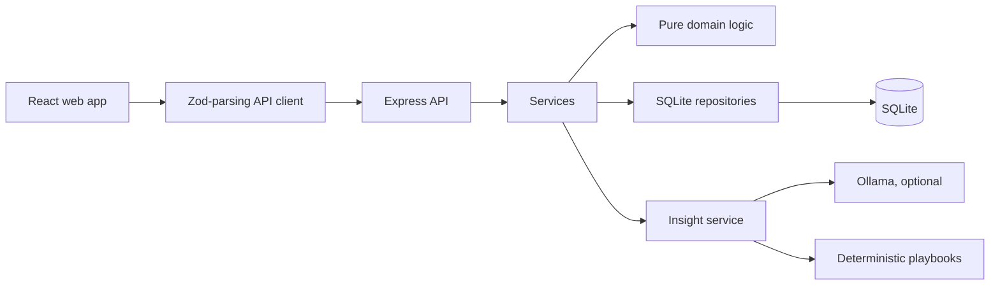

# Renewable Operations Incident Board

A small full-stack incident board for a solar and battery storage operations team. It ranks active alerts by operational urgency, shows what happened, lets an operator record status changes and follow-up notes, and provides an AI-assisted summary/next-action panel with deterministic fallback.

Live demo: https://renewable-incident-board-2i2cfcy4cq-ts.a.run.app

## Quick Start

Prerequisites:

- Node.js 22 or newer.
- npm 11 or newer. If needed: `npm install -g npm@11`.
- Optional for live AI: Ollama with `llama3.2:3b`.

Run locally:

```sh
npm ci
npm run dev
```

Then open `http://localhost:5173`. The API runs on `http://localhost:3001` and seeds `./data/incident-board.db` on first boot.

Optional live AI setup:

```sh
brew install ollama
ollama serve
ollama pull llama3.2:3b
```

If Ollama is not running, insight generation still returns a useful deterministic playbook result with `degraded: true`.

## What Is Included

- 18 realistic mock alerts across 6 solar, battery, and hybrid sites.
- SQLite persistence through `better-sqlite3`.
- Express API with Zod validation on env, requests, DB hydration, AI output, and frontend responses.
- React/Vite frontend with KPI strip, needs-attention queue, URL-synced filters, responsive alert list, and detail drawer.
- Status changes, notes, and AI generations recorded in an audit timeline.
- AI-assisted alert assessment with provenance, warnings, priority cross-checks, and feedback.
- Unit/integration tests, Playwright E2E, axe checks, responsive layout audit, eval harness, CI, and Docker files.

## Architecture



API layering is `routes -> services -> repositories -> db`. Domain logic for triage, status transitions, and playbooks is framework-free so it can be tested directly.

Shared schemas live in `packages/shared`. The API validates inbound data and the web client re-parses responses with the same Zod schemas, so contract drift fails loudly.

## Product Decisions

Severity alone is not enough to rank operational work. The board computes priority from severity, alert category, site capacity, age, and current status. A new high-severity outage on a 48 MW site can outrank a critical alert already being worked.

`needsAttention` is intentionally crisp: an alert is new or acknowledged and either P1/P2 or past its acknowledgement SLA. P4 items do not enter the act-now queue merely because they are old.

The detail drawer keeps the board visible on desktop because operators often compare the current alert with the next urgent item. On smaller screens the same panel behaves as a full-width sheet.

## AI Feature

`POST /api/alerts/:id/insight` returns:

- plain-English summary
- likely causes
- suggested priority with rationale
- suggested next actions with owner and urgency
- safety flag and confidence
- provenance, warnings, rule baseline, and disagreement metadata

The primary live path is Ollama:

- default model: `llama3.2:3b`
- `temperature: 0`
- structured JSON output where supported
- 60 second timeout
- rate limit and single-flight per alert

The deterministic rules engine is not a replacement model. It is used for fallback, testability, and as an independent baseline for checking model priority.

Limitations:

- A 3B local model can hallucinate and reason poorly about numbers.
- JSON mode constrains shape, not truth.
- The assistant only sees the alert record and recent notes, not live telemetry.
- The playbooks are plausible but have not been validated by a domain expert.
- The synthetic eval set is useful for regressions, not statistical proof.

How output is checked:

- Zod schema validation and one repair attempt.
- Groundedness guard for invented numbers and wrong-site references.
- Prompt-injection scan on alert text and notes.
- Priority comparison against deterministic triage.
- In-product helpful/not-helpful feedback.
- `npm run eval` over the labelled seed set.

## Commands

```sh
npm run lint
npm run typecheck
npm test
npm run build
npm run e2e
npm run eval
```

Useful Make targets:

```sh
make help
make dev
make reset-db
make up
make ai-check
```

The default E2E suite disables live AI for deterministic CI. To run the live Ollama test:

```sh
E2E_LIVE_AI=1 npm run e2e -- --grep @live
```

## API

- `GET /api/health`
- `GET /api/sites`
- `GET /api/stats`
- `GET /api/alerts`
- `GET /api/alerts/:id`
- `PATCH /api/alerts/:id`
- `POST /api/alerts/:id/notes`
- `POST /api/alerts/:id/insight`
- `POST /api/alerts/:id/insight/feedback`

Errors use `{ error: { code, message, details?, requestId } }`.

Writes use optimistic concurrency via `expectedVersion`, so simultaneous operator edits cannot silently overwrite each other.

## Persistence

By default the API uses `./data/incident-board.db`. The database is migrated on boot and seeded only if empty.

Reset local demo data:

```sh
npm run seed -- --force
```

## Containers

Production compose:

```sh
docker compose up --build
```

Then open `http://localhost:8080`.

The API container stores SQLite data in the `incident-data` volume and points to native host Ollama at `http://host.docker.internal:11434`.

Docker Desktop must be running before image builds or compose can be verified.

Cloud Run deploy:

```sh
gcloud run deploy renewable-incident-board \
  --source . \
  --region australia-southeast1 \
  --allow-unauthenticated \
  --set-env-vars NODE_ENV=production,DATABASE_PATH=/tmp/incident-board.db,SEED_ON_BOOT=true,AI_ENABLED=false,WEB_DIST_PATH=/app/apps/web/dist,CORS_ORIGIN=*
```

The root `Dockerfile` is a single-service Cloud Run image: Express serves `/api/*` and the built React app from the same container. This demo deployment uses ephemeral SQLite in `/tmp`; use the compose setup or a mounted volume/backing database for durable production data.

## Trade-Offs

- SQLite keeps setup simple and gives real persistence, but this is a single-process/small-team design.
- Local Ollama avoids paid APIs and data egress, but quality and latency depend on the reviewer's machine.
- React/CSS Modules avoid a large UI framework, but more widgets are hand-built.
- The layout audit checks visible clipped text rectangles, which is a practical automated guard against overlap, not a replacement for visual review.
- The AI eval is deliberately small and transparent rather than pretending to be a statistically robust benchmark.

## AI Usage

AI tools were used. See [AI_USAGE.md](AI_USAGE.md) and the raw Claude export at [docs/claude-code-session.jsonl](docs/claude-code-session.jsonl).
